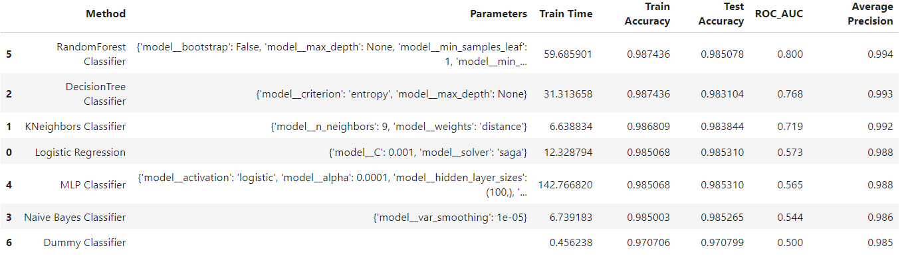

## What 

As part of this exercise, I have examined the dataset from Portuguese banking institution, which has information about a collection of the results of multiple marketing campaigns. Leveraging this data and by applying various classifier models, I have explored the factors that influence the decision to purchase a term deposit product. 

- Here is the [Data](https://github.com/csonamohan/module_17_starter/blob/main/data/bank-additional/bank-additional-full.csv)
- Here is the [Notebook](https://github.com/csonamohan/module_17_starter/blob/main/prompt_III.ipynb)

## Objective

The objective is to to compare the performance of the classifiers (k-nearest neighbors, logistic regression, decision trees, and support vector machines) to accurately predict if client will subscribe to a term deposit. By identifying customers who are likely to subcribe, we aim to proactively direct the campaigns to them through targeted marketing and thus increase campaign efficiency and reduce costs involved.

## Target Variable:

The target variable is "y", which has two classes:

"Yes": Customers who has subscribed to term deposit "No": Customers who has not subscribed to term deposit

## Benefits:

Achieving this goal will allow us to:

Increase customer revenue by implementing personalized term deposit acquisition campaigns. Reduce marketing costs by focusing on customers who have a greater propensity to get term deposits. Improve customer satisfaction by addressing customer needs.

## Exploring the data

A detailed look at the data some interesting facts - 

## Pre-processing Data - Phase 1

The data provided encompasses 20 attributes, providing valuable insights about the potential customers. I took the following steps to understand that data and prepare it for data modeling - 

- Identified features and target variables
- Found the number of null values in the dataset - there were a fair number of null values in occupation_type column.
- Removed the column as part of data cleanup.

Using the variance inflation factor, I have checked if the the features themselves are correlated - 

1. Multicollinearity occurs when two or more predictor variables in the model are highly correlated.
2. Variance Inflation Factor (VIF) is 1.0 for all columns except children, family_status and mobile which are highly correlated with each other.
3. Hence, we need to drop children , family_status & mobile columns from our independent variable list to get best results.

As a next step, I looked at the datatypes of the different features. I converted non-numeric features to numeric with the help of one-hot-encoding and LabelBinarizer

After scaling the data, I have plotted the explained variance to number of components. It is clear that ~35 components explain 95% of all variance.

## Modeling 

After making the necessary changes, I split the dataset into test and train sets. I then ran the different classifier models with gridsearchcv to arrive at the right hyper parameters. Since the original dataset was so large, I used a fraction of the training and test datasets to arrive at the parameters.

With the right set of hyperparameters, I trained the entire training dataset with the different classifiers- Logistic regression, decisiontree classifier, k-nearest neighbors, support vector machines, Random Forest Classifier, Neural Network Classifier and Naive Bayes Classifier. 

## Observation:

- Random Forest has the best ROC_AOC score but takes time to train.
- DecisionTree classifier has the next highest score with good enough training time.
- KNN is the next highest with the lowest training time.
- SVC has the highest training time
​

### ROC-AUC Curve and Score:

Curve shape rises quickly: The curve rises quickly towards the top-left corner, indicating that the classifier is good at distinguishing between the positive and negative classes.
High TPR, Low FPR: A higher TPR with a lower FPR means the classifier correctly identifies most of the positive instances while minimizing false positives.
Value: The ROC AUC score, displayed in the legend (e.g., area = 0.82), is close enough to 1.0. This indicates good model performance.
Interpretation: An ROC AUC score of 0.82 means that there is a 82% chance that the classifier will rank a randomly chosen positive instance higher than a randomly chosen negative one.

### Feature Importance:

Using Randomsearch Classifier's importance score, we can identify the feature importances. Age, Income, Working years and Months balance are the most important features that give good indication of credit of a customer. Owning a car, a realty and phone are the next set of important features.

## Conclusion

It is clear that there are a few features have a greater influence on target variable. Using gridsearchcv, it is possible to make the the different models more accurate with more optimized hyper parameters KNN Classifier, Decisiontree Classifier and SVC show similar test and train acccuracy. However, the training time is the least with KNN and most with SVC.

## Next steps / Recommendations

We would continue with fine tuning the study - 
    
1. Cross-Validation: We could do K-Fold Cross-Validation by splitting the data into k subsets, training the models k times, each time using a different subset as the validation set and the remaining data as the training set.
2. Regularization - We could do L1 and L2 Regularization by adding regularization terms to the loss function to prevent overfitting.
Dropout (for Neural Networks): Randomly drop units during training to prevent co-adaptation.
3. Early Stopping - We could monitor model performance on a validation set and stop training when performance starts to degrade.
4. Better Model Evaluation with different metrics - We could use Precision, Recall, F1 Score, AUC-ROC, AUC-PR, and Specificity instead of just Accuracy.
